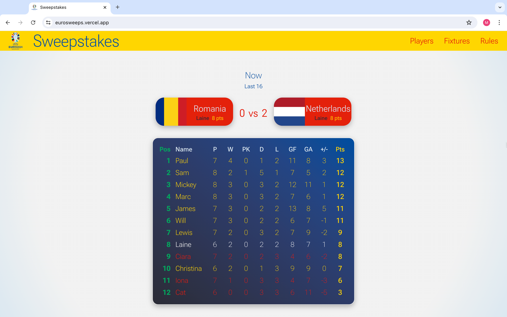
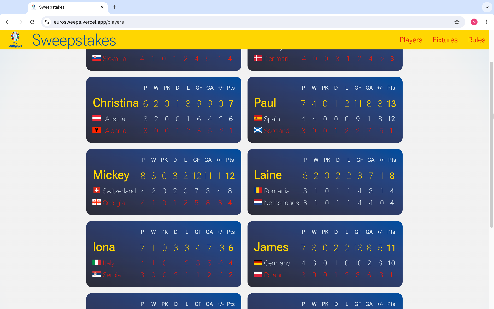
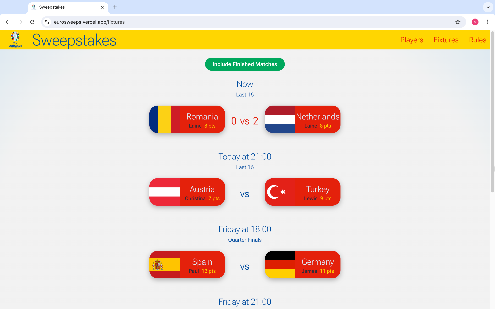

<h1 align="center"><a href="https://eurosweeps.vercel.app/">Sweepstakes League</a></h1>
<p align="center"></p>


<p align="center">Welcome to the Sweepstakes League! This project was designed for colleagues at my previous teaching job, adding a fun competitive twist to a European football competition.</p>

<details>
  <summary>Table of Contents</summary>
  <ol>
    <li><a href="#overview">Overview</a></li>
    <li><a href="#features">Features</a></li>
    <li><a href="#technologies-used">Technologies Used</a></li>
    <li><a href="#external-api">External API</a></li>
    <li><a href="#styling-and-design">Styling and Design</a></li>
    <li><a href="#important-notes">Important Notes</a></li>
    <li><a href="#using-the-website">Using the Website</a></li>
    <li><a href="#setup-instructions">Setup Instructions</a></li>
    <li><a href="#future-improvements">Future Improvements</a></li>
  </ol>
</details>

## Overview

The app randomly assigns teams from a European competition to players and tracks their performance over the course of the tournament. Points are awarded based on how each team performs, and players are ranked in a league accordingly. The project is built using React (via Vite) on the frontend, styled with styled-components, and powered by a Node.js (Express) backend, connected to a MongoDB database.

## Features:
<ul>
  <li>Random team assignment for each player via Live Draw!</li>
  <li>Automated point calculation based on live team performances through real-time updates from an external API.</li>
  <li>Player rankings are updated automatically as new match results come in.</li>
  <li>Full fixture list.</li>
  <li>Individual player cards.</li>
  <li>Fun and colorful interface inspired by the Euro 2024 color palette.</li>
</ul>

## Technologies Used
### Frontend:
<ul>
  <li>React (via Vite)</li>
  <li>JavaScript</li>
  <li>CSS (via Styled Components)</li>
  <li>HTML</li>
</ul>

### Backend:
<ul>
  <li>Node.js</li>
  <li>Axios Library (proxy server)</li>
  <li>Express</li>
  <li>MongoDB</li>
</ul>

## External API:
<ul>
  <li>Fetching live data from <i>football-data.org/</i>'s external API to update player scores based on team performance.</li>
  <li>Populating and updating player records with team performance data automatically.</li>
</ul>

## Styling and Design

The app features a playful and colorful design, using a color palette inspired by the Euro 2024 logo. The interface was designed to be engaging, though in retrospect, I feel it may have been a little too heavy on primary colors. Future designs may incorporate a more subdued color scheme.

## Project Preview

### Home 
### Players 
### Fixtures 

## Important Notes:
The app connects to a database hosted on a free server, which may spin down due to inactivity. Please be patient when first visiting the website or loading the app as it may take around one minute to establish a connection.
A loading spinner has been incorporated to indicate when the app is fetching data from the database and external API.

## Using the Website
<ul>
  <li>Upon launching the app, a message on the homepage will provide further details on how to interact with it.</li>
  <li>To see the finished results of the league, simply enter "liga" in the input field.</li>
  <li>If you wish to view a live draw where players are randomly assigned teams, enter any word in the input field (except "liga") to create a new league. Please note that as the competition is over, the teams already have data associated with their matches.</li>
</ul>

## Setup Instructions
To install Sweepstakes locally, follow these steps:

<ol>
  <li>Clone this repository:
    
```bash
git clone https://github.com/nuinn/sweepstakes_client.git
```
  <li>Navigate to the project directory:</li>

```bash
cd sweepstakes_client
```

  <li>Install dependencies using npm:</li>

```bash
npm install
```

Or using yarn:

```bash
yarn install
```

<li>Run the development server:

```bash
npm run dev
```
Or with yarn:

```bash

yarn dev
```
<li>Access the application in your web browser at http://localhost:5173.
</ol>

## Future Improvements
<ul>
  <li><strong>Color Scheme:</strong> I plan to rework the app's color palette in future versions to make it more subtle and visually balanced.</li>
  <li><strong>Loading Times:</strong> Explore ways to reduce latency when connecting to the free server.</li>
</ul>

<br>

Feel free to contribute to Tu Appministrador by submitting pull requests or reporting issues on GitHub. Your feedback is valuable in improving the application and addressing community needs effectively.

<br>

<h3 align="center">Licensed and Developed by</h3>

<p align="center">Marc Dilley</p>
<p align="center">
<a href = "mailto:marcdilley@gmail.com"></a>
    <a href="https://www.linkedin.com/in/marc-dilley-288407a1/" target="_blank"></a> 
  <a href="https://github.com/nuinn/"></a>
</p>
